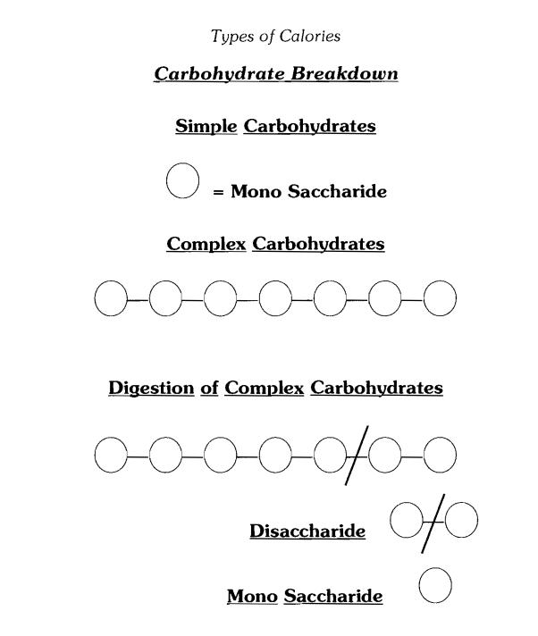

== Type of Calories

:icons: font

Calories are derived from foods and there are three types or sub groups of calories. They are carbohydrates, proteins and fat.

Carbohydrates are derived from non animal foods. Examples of healthier carbohydrates include rice, pasta, beans, breads, potatoes, yams and fruit. Other carbohydrates, sometimes called "manufactured carbs" include pretzels, low fat cakes, cookies and related items. Of course, desserts are full of carbohydrates found in the flour and sugar and, in most cases, they're loaded with fat. For our purpose, we're trying to differentiate, "what's a pure carbohydrate".

All carbohydrate foods are eventually digested, broken down and absorbed as sugar - sometimes called blood glucose. Technically, there's not much of a difference eating rice, potatoes or candy. All three dissolve and digest into a simple form of sugar called glucose.

The body keeps a tight check on the amount of sugar in the blood. For the body to function normally, the **concentration** of sugar within the blood remains fairly stable or "normal" between 70 mg/100 ml to 110 mg/100 ml of blood. In other words, the body prefers a sugar range of 70-110 mgs of glucose within a millimeter of blood. Still, to uncomplicate it a bit further, simply think of the 70-110 range as something that is quite normal and a guideline the

body has self imposed to keep it functioning at normal levels. One more thing; as sugar levels rise towards 110, and especially if sugar levels rise above 110, the body will attempt to reach a state of homeostasis - or a "balanced state" by releasing a "clearing" or "storage" hormone which whisks the excess sugar out of the blood and stores it into muscle tissue or fat tissue. On the other hand, when sugar levels approach 70, or fall below 70, the body releases a "liberating" or "breakdown" hormone which pulls sugar out of muscle tissue and drags it back into the blood. The storage hormone is called **insulin** while its opposing hormone, the liberator is called **glucagon.** It both cases, there exists somewhat of a tug-o-war where the body throws into action insulin **or** glucagon to keep blood glucose levels in a comfortable zone of 70-110.

To move on, we have to make a few assumptions, one being the 180 pounder will need 1800 calories a day - with no activity, *at complete and absolute rest.* Sure the 1800 calorie guestimate is not dead on and 100% accurate, but it's darn close, more than "in the ballpark." The 180 pounder who sits all day and remains completely inactive will need approximately 1800 calories to maintain his weight, to maintain his muscle mass and to keep the organs healthy. At 1800 calories a day, the 180 pounder would likely stay within a 70-110 range with regards to blood sugar levels, though likely closer to the lower end of 70.

When more calories are consumed than the body needs each day, and especially carbohydrate calories, the amount of sugar in the blood rises. When blood sugar levels rise, the body will kick up its production of insulin and store some of the carbohydrates so they can be used later. In general, the body stores the excess carbohydrates in the muscles as muscle glycogen or in the liver as liver glycogen. Glycogen is really nothing more than a **storage tank for sugar.** When sugar levels in the blood rise above 110, the body begins to pack away the excess sugar in these reserves. To a smaller degree, the body is capable of storing excess sugar as body fat as we'll see later. Though excess sugar from the blood is

commonly whisked away and stored as muscle or liver glycogen, the tanks that capture sugar within both the muscles and liver are limited. In simple terms, the muscles or liver can only hold onto "so much" sugar. **Once these tanks are full, excess carbs will be stored as body fat.**

For example, the 180 pounder eating 3000 calories a day, yet remaining completely inactive, will experience chronically high sugar levels within the blood from munching down carbohydrate calories beyond what he needs each day. After a day or so, his muscles and liver will quickly fill up with glucose, forming "full to the brim" amounts of glycogen. At that point, all extra carbohydrates will be stored as body fat.
*In most cases, if glycogen stores are not full, excess carbs will be deposited as glycogen.* If glycogen stores are full, excess carbs will be stored as fat.

When calories remain closer to 1800 in the completely inactive 180 pounder, the concentration of sugar within the blood falls closer to 70 and very easily can fall below 70. When this occurs, the body outputs glucagon which permits sugar to flow out of glycogen and liver reserves. In effect, glucagon causes muscles and liver to "give up" sugar, to restore blood sugar levels closer to a normal range of 70-110. If calories and carbohydrates stay low for an extended period of time, the glucagon will also begin to liberate fatty acids from fat cells. Thus, glucagon can not only drag sugar from glycogen stores, but it can promote the breakdown of fat cells so fatty acids can be used as fuel.

[.text-center]
**Protein**

Protein is derived from animal foods; chicken, turkey, meats, lamb, fish and all dairy products are complete sources of protein. These foods are commonly referred to as "complete" because they contain all of the essential amino acids, the tiny building blocks required for health. The protein found in non animal sources of food are called "incomplete" proteins. Incomplete proteins lack 1 or more of the essential amino acids.

Thus, proteins supply the building blocks of life called amino acids. All animal source protein foods are digested, broken down and absorbed as amino acids akin to the way carbohydrates are broken down into glucose. Amino acids are to proteins as glucose is to carbohydrates. Aminos are the "tiny fragments" of protein while glucose is the "tiny fragments" of carbohydrates.

Amino acids are used for thousands, likely multi-millions, of reactions in the body. Low protein-low calories diets promote self catabolism. In other words, a low calorie diet that is also too low in protein causes the body to scavenge for the aminos necessary for everything from immune support, hormone production, to strong teeth and healthy hair. If the body is low on protein and there is insufficient amino acids in what's termed "amino acid pools"- temporary waiting pins for amino acids consumed from recently eaten protein foods - the body enters a state of catabolism. Catabolism is derived from the word catabolic which is really a fancy way to say, "canabalism." That is, when calories are low and protein intake is low, the body, in dire need of essential amino acids to maintain life itself, will begin to tear apart it's muscle tissue and organs as both are literally comprised or "made up of" amino acids. Interestingly, the body will, with the help of glucagon, take those amino acids that have been torn apart from muscle tissue and convert the aminos into glucose! Called gluconeogenesis, its sort of a survival mechanism in two ways.

**1.** First, when calories are way too low, the body can make sugar to keep itself alive by catabolising/canabolising its own muscle tissue into glucose. Specifically, this catabolism of muscle is used to fuel the brain. The brain is the "crown jewel" of all human organs. It's what makes us human and distinctly different from animals and it is glucose that keeps the brain alive. Survival wise, the body can eat up its own tissue to make sugar. Why? So a starving human can decide what to do next, to put an end to such hunger. Crude. But true.

**2.** Second, when muscle tissue falls, the body's internal engine, called metabolism drops. When the metabolism drops, or the total amount of calories it burns each day decreases, the body requires less fuel so, in the long run, it will have lowered its demands for fuel by stripping off its own muscle mass. Again. It's about survival. Getting the body to burn less so it can survive and, if needed, search longer, for food.

Thinking about embarking on a low calorie and low protein diet? Think again. The combo's a dead end and will lower your metabolic rate making fat loss very difficult. Remember the person weighing 180 pounds and requiring 1800 calories daily? Imagine having shed away 15 pounds of muscle with an extreme low calorie-low protein diet, ending up at 165 pounds. In effect, he would have lowered his daily caloric demands to 1650 a day (at complete rest). Not the best move if fat loss is the goal.

image::../../imgs/Tissue-loss-associated-with-low-protein-low-calorie-instake.png[]

- 1. Muscles breakdown and release amino acids
- 2. Amino Acids are sent to the liver
- 3. Liver changes amino acids into glucose (sugar)
- 4. Glucose enters blood from the liver

[.text-center]
**Result: Muscle Wastage!!!**

While carbohydrates release insulin, the sugar storing hormone, proteins release both insulin and glucagon,
with glucagon being the more dominant of the two. Thus, from a hormonal point of view, we can assume carbs have a greater potential to store or stimulate the accumulation of body fat because carbohydrates exclusively kick up insulin levels which can effect the storage of carbs as not only muscle and liver glycogen, but body fat. On the other hand, protein tends to kick up glucagon levels. The benefit of glucagon? It can off set the fat storing potential of high insulin levels and it has the potential to stimulate the fat burning cycle within the body by liberating fatty acids from fat cells.

Protein also is calorically inferior to carbs and dietary fat. Simply, the body is less efficient in abstracting 100% of the calories found within protein foods than it is from abstracting energy from carbohydrates or dietary fat. When you eat 100 calories of dietary fat, say a tablespoon of butter, the body will ultimately "gain access" to 97 of those calories as it is efficient in breaking down fats and using them as fuel. With carbohydrates, the body is a little less efficient. For every 100 calories you eat, the body will access roughly 88-90 of them. The other 10-12 calories are "burned away" in the process of breaking down the food. Since breaking down carbohydrate foods "costs" energy, we can say there is a small increase in metabolism that comes from eating. With dietary protein, the body is rather inefficient in obtaining 100% of the calories found within the protein. For example, when you eat a chicken breast that yields 200 calories, reality is, the body is roughly 80% effective in "accessing" all 200 calories. Instead, only 80% of the total 200 calories is accessible. Therefore, your 200 calorie chicken breast ultimately yields 160 calories.

Where does the other 40 calories go? They're "wasted" or burned in breaking down the food. The bottom line here is that the foods we eat supply us with fuel in the form of calories but the body expends fuel in order to obtain the fuel within the foods.

**REVIEW NOTES:**

- 1. Carbohydrates release insulin.
- 2. Insulin is a hormone with storage properties.
- 3. In the absence of carbohydrates or with a low calorie diet, blood sugar levels decrease which increases the output of glucagon.
- 4. Glucagon is a hormone with liberating properties.
- 5. Proteins release insulin and glucagon.
- 6. The glucagon released with protein foods is greater than the insulin release.
- 7. The body expends fuel in trying to obtain fuel from the foods we eat.
- 8. The body expends more fuel in obtaining fuel from protein, less with carbs and still even less with dietary fat.

**Fats**

Dietary fats have the greatest reputation as a fat storer though we, as Americans, have seemed to have switched our focus away from concentrating on dietary fat. These days, dieters focus on both carbs and fat.

Each gram of dietary fat yields 9 calories while each gram of protein yields 4 and a gram of carbohydrate also yields 4 calories. Throwing in the body's "inefficiency" at obtaining 100% of the calories from the foods we eat, it is rather clear how the common adage "fat is more fattening than carbs or protein" came to be.

Let's take a closer look at dietary fat versus dietary carbohydrates and dietary protein.

- 100 calories of fat at which 97% is "accessible" = 97 calories
- 100 calories of carbohydrates at which 90% is "accessible" = 90 cal.
- 100 calories of protein at which 80% is "accessible" = 80 calories

As you can see, fat is "more fattening" than carbs or protein. Furthermore, **gram for gram,** fats produce more energy in the body than carbs or protein. For example, one gram of dietary fat yields 9 calories per gram while a gram of either carbohydrate or protein yields 4 calories per gram. A side by side comparison of 100 grams of fat, carbs or protein illustrates dietary fat is more calorically generous of the three.

- 100 grams of fat at 9 calories per gram = 900 calories
- 100 grams of carbohydrate at 4 calories per gram = 400 calories
- 100 grams of protein at 4 calories per gram = 400 calories.

Very simply, in terms of calories, you would have to eat 225 grams of protein or 225 grams of carbohydrates to yield the same calories found in 100 grams of dietary fat.

- 100 grams of fat at 9 calories per gram = 900 calories
- 225 grams of carbs at 4 calories per gram = 900 calories
- 225 grams of protein at 4 calories per gram = 900 calories

Yet another aspect to consider in trying to control total caloric intake is food volume. Fatty foods, which yield gram for gram more than 100% more calories than carbohydrates and protein, usually do not take up much "space" within the stomach. Nor are they visually voluminous. For example, 2 tablespoons of olive oil yield 228 calories while 4 inch by 4 inch potato yields the same amount of calories. And a large chicken breast would yield approximately the same number of total calories. Of the three, which is physically smaller in size and likely the one that would be easier to over eat? The oil.

[.text-center]
**Sugar: The Nitty Gritty**

Back to carbohydrates. All carbohydrates foods we eat - whether a potato, a yam, a cup of rice, candy, or a can of soda - will ultimately be digested and absorbed into the blood stream as a simple sugar called glucose. Glucose is sometimes referred to as blood sugar. Glucose stimulates the pancreas to release the specialized storage hormone called insulin. And it is insulin's job to regulate "how much" glucose shall remain in the blood.
*The total amount of insulin released is related to the concentration of glucose in the blood and the concentration is related to your total carbohydrate intake.*

If there is a concentrated amount of glucose in the blood, in laymen's terms, "a lot of sugar in the blood" the pancreas responds by kicking out a large burst of insulin. If there is a moderate amount of glucose present in the blood, the pancreas responds by kicking out far less insulin. When there is is very small amounts of glucose in the blood, the pancreas puts out dramatically less insulin. In real world terms, eating a massive amount of carbohydrates from an overflowing plate of pasta would flood the blood stream with glucose and kick insulin levels through the roof. A moderate serving of pasta would increase insulin levels, but not nearly to the degree a larger plate would. And a small plate would also promote insulin secretion by the pancreas, albeit dramatically less than a massive plate of pasta and still less than a moderate plate. In all three cases, insulin clears sugar from the blood and deposits it into tissues. The tissues include your muscles, your liver and body fat stores. The first two locations aren't the real problem. When carbs are stored in muscle and liver, they can be readily accessed in between meals if sugar levels within the blood fall or they can be used during exercise. The latter of the three cites, fat stores, is the place the individual, in search of a lean body, hopes to avoid.

We can classify carbohydrates as two main groups with a smaller sub group. The two main groups are simple

carbohydrates and complex carbohydrates. Simple carbohydrates are sugars known as monosaccharides. They are found in fruits, fruit juices, honey, jellies, jams, soda pop and table sugar. Complex carbohydrates are nothing more than multiple chains of simple sugars linked together to form a "complex" or "longer" chain carbohydrate. In general, complex carbohydrates are those *"found in nature;"* wild rice, yams, potatoes, beans, corn, peas, oatmeal, rye cereal and bread made with only unmilled whole wheat flour. These carbohydrates illicit a "lesser insulin response" than **manufactured carbohydrates;** white bread, white rice, cookies, pastries, and all the fat free carbo-rich products like fat free cookies, cakes, potato chips, pretzels and cold cereals. **Manufactured carbs release, calorie for calorie, more insulin than natural carbs.**

For example 100 calories of carbohydrates from a yam yields less total insulin than 100 calories of carbohydrates from pretzels.

Simple carbohydrates are broken down, digested and absorbed with ease and speed compared to "more natural" carbs. The result of their ease to digest; glucose quickly accumulates in the blood stream and the pancreas reacts by dumping a large amount of insulin into the blood. **Again, the net amount of glucose in the blood at any period of time is directly related to the amount of insulin released.** With complex carbohydrates, the speed at which they enter the blood as glucose is slower because the body must cleave the longer chains of sugar, one by one, into smaller sub units of sugar, before they can ultimately become glucose.

In terms of controlling body fat, the difference between simple and complex carbohydrates is the speed at which they enter the blood as glucose and the total amount of insulin that is released. As we will see, elevated insulin levels impact fat storage.
While 200 calories of yams will illicit less insulin than 200 calories of a refined food such as pretzels or fat free potato chips, there is another aspect of complex carbs to consider. The more refined, processed or cooked the complex carbohydrate, the faster it breaks down into glucose which, in turn, effects insulin levels. Whole grain bread is processed

into white bread. Brown rice is processed into white rice and corn is processed into corn flakes. A potato "baked" in a microwave, in general, is more firm than one baked in a conventional oven and mashed potatoes are clearly less firm or "softer" than a baked potato. The big deal? The more processed the carb and the softer the carb, the easier it is to digest and the easier it is to digest, the greater the insulin spike.

**REVIEW**

- 1) The two types of carbohydrates include simple and complex.
- 2) Simple are usually "man made." Examples include fat free pop tarts, pretzels or candy.
- 3) Complex are "more natural." Examples include yams, wild rice and potatoes.
- 4) Simple carbs illicit more insulin than complex.
- 5) Elevated insulin impact fat storage.

[.text-center]
**The Fiber Connection**

Fiber has been touted as a promising tool in weight control and with good reason. Fiber is termed "a non-digestible food substance" common to carbohydrate foods. While the main categories for carbohydrates fall into the groupings of simple or complex, fiber-type carbohydrates comprise a third and separate group. Fiber-type carbs include crunchy-hard-to-chew vegetables that are not only extremely low in calories, but essentially calorie free! That's because the body lacks the enzymes to break down fiber and obtain the calories found within the food. The result of eating fiber-type vegetables? They pass right through the body yielding no calories. In fact, fiber-type carbohydrates may actually cost you calories. Here's how. When you eat, it costs the body calories to begin to work on food to break it down and digest it. When you eat a cup of vegetables, the body works to obtain the fuel from the food. In an attempt to obtain fuel from vegetables, calories are expended. Another way of looking at it; the body uses its own fuel so energy is "expended" in trying to gain fuel from the foods consumed. However, vegetables are nothing more than zero-energy yielding foods. They don't produce usable energy for the body and the human body is incapable of making use of fiber as fuel. The net effect: calories are burned off eating vegetables. Plus, these carbs don't effect insulin levels.

**Common fiber-type vegetables include:**

[width="100%",cols="33.33%,33.33%,33.33%",options="header"]
|===
| Asparagus   | Green beans | Squash (spaghetti)
| Broccoli    | Lettuce     | Squash (summer)
| Cabbage     | Mushrooms   | Water chestnuts
| Cauliflower | Okra        | Wax beans
| Celery      | Radish      | Zucchini
| Eggplant    | Spinach     |
|===

Vegetables obviously are beneficial in that they are very difficult to "over eat" and they make you feel satisfied. A person may find it relatively easy to gulp down 3 cups of pasta yielding 450 calories and approximately 135 grams of carbohydrates, yet would likely find it either more difficult or less pleasurable to chomp down 3 cups of broccoli yielding 120 calories and 30 grams of carbohydrates - all of which are unabsorbable as they are "locked within" the fiber - nature's "undigestible carb."

The added benefit of fiber-type carbs is their effect on insulin. When complex or simple carbohydrates are combined with fiber-type vegetables, the speed at which the glucose from the complex or simple carbohydrates "hits" the blood stream is retarded. In effect, adding veggies to a complex or simple carb slows the rate at which glucose reaches the blood. If glucose enters the blood at a slower pace, the pancreas responds by outputting less insulin. A simple comparison; 200 calories of rice versus 200 calories of rice mixed with a cup of cauliflower. The rice-only meal will illicit a greater insulin burst than the rice-veggie combo. Fiber-type veggies act as a natural "time releasing" agent on simple or complex carbs

and it is this time releasing effect that impacts insulin levels.

The tiny amounts of fiber, or lack of fiber, in many complex carbohydrates effects insulin secretion. Wild rice contains small amounts of fiber compared to bleached white rice and real whole grain bread contains more fiber than white bread. While all are considered complex carbohydrates due to their long branching web of glucose molecules bound together, they are digested at different speeds due to varying fiber content. The white rice will digest faster than wild rice and therefore will kick insulin levels higher. Likewise, white bread, which is devoid of fiber, digests much faster than whole grain bread. The net result? White bread creates a greater insulin response than whole grain bread and the greater the insulin response, the greater the effect on the complex system that keeps you fat!

In the full scope of things, total calories effect body fat levels as do the types of calories we eat. Carbs, protein and fat are unique in:

- 1 Their calorie value.
- 2 The body's ability to "access" those calories.
- 3 Their effect on insulin levels.

[.text-center]
**Sugar, Insulin and Fat Dynamics**

Insulin has positive and negative effects on the body. In terms of controlling body fat, the ultimate success one achieves depends on total calorie intake and the hormones effected by the types of calories we eat.

Elevated insulin levels for the person hoping to control body fat is, possibly, as detrimental as total caloric intake. High or elevated insulin levels result from overeating carbohydrate foods - either complex carbs or simple carbs. When you overeat carbohydrates, you increase the amount of glucose in the blood above 110 which promotes an insulin burst which drags the excess sugar out of the blood allowing glucose levels to return to normal, around 70 to 110.

Here's the tough part. It is possible to stay within your caloric limits and create an environment where insulin levels

remain chronically elevated making it almost impossible to get lean. This occurs when one follows either a diet that is extremely low in fiber or when a person obtains the majority of his calories from fast-to-digest simple carbohydrates like soda, jams, refined white bread, cakes, cookies, crackers, pretzels, fat free chips, imitation fruit drinks and fruit juices. These foods rapidly digest into glucose which promotes a quick collection of glucose in the blood surging glucose levels above 110. The result? An insulin spike. A really big insulin spike.

When insulin levels rise, excess glucose is cleared from the blood and deposited into muscle glycogen, liver glycogen or fat stores. If muscle and liver stores for glucose are full, all glucose will be packed away as body fat. *If there is room within the muscles or liver for additional glucose, excessive glucose is likely to be stored as glycogen.*

However, high insulin levels, the result of eating above your caloric requirements or from eating within your caloric requirements yet choosing simple fast digesting carbs, can promote the storage of body fat even if muscle and liver stores for glucose are not full! Not sure? How many people do you know claim "Not to over eat" yet continue to gain fat year after year. The likely culprit? A highly refined diet comprised of next-to-no fiber and abundant in simple sugars. Together, this nutrition approach continually keeps a concentrated source of glucose in the blood which keeps insulin levels elevated which, in turn, packs away sugar as body fat and, as we will see, prevents the body from tapping into body fat stores.

High insulin levels also effect the appetite center in the brain. Rats injected with high levels of insulin will eat until their stomach explode while rats that have the pancreas removed (which manufactures insulin) will refuse to eat and starve to death. *In high amounts, insulin is an appetite stimulant.*

High insulin levels also exert other interesting metabolic effects encouraging fat storage and preventing the liberation