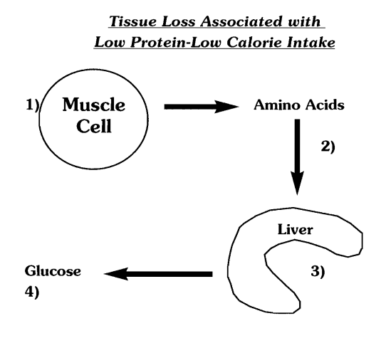

== Tipos de calorías

Las calorías provienen de los alimentos y hay tres tipos o subgrupos de calorías: los carbohidratos, las proteínas y las grasas.

Los carbohidratos provienen de alimentos no animales. Ejemplos de carbohidratos más saludables incluyen arroz, pasta, frijoles, pan, patatas, ñames y frutas. Otros carbohidratos, a veces llamados "carbohidratos manufacturados", incluyen pretzels, pasteles bajos en grasa, galletas y artículos relacionados. Por supuesto, los postres están llenos de carbohidratos presentes en la harina y el azúcar y, en la mayoría de los casos, están cargados de grasa. Para nuestro propósito, intentamos diferenciar "qué es un carbohidrato puro".

Todos los alimentos con carbohidratos son eventualmente digeridos, descompuestos y absorbidos como azúcar, a veces llamada glucosa en sangre. Técnicamente, no hay mucha diferencia entre comer arroz, patatas o caramelos. Los tres se disuelven y digieren en una forma simple de azúcar llamada glucosa.

El cuerpo mantiene un control estricto sobre la cantidad de azúcar en la sangre. Para que el cuerpo funcione con normalidad, la **concentración** de azúcar en la sangre se mantiene bastante estable o "normal" entre 70 mg/100 ml y 110 mg/100 ml de sangre. En otras palabras, el cuerpo prefiere un rango de azúcar de 70-110 mg de glucosa por milímetro de sangre. Para simplificarlo aún más, piensa en el rango 70-110 como algo completamente normal y una referencia que el cuerpo se ha autoimpuesto para mantenerse funcionando a niveles normales.

Una cosa más: cuando los niveles de azúcar suben hacia 110, y especialmente si superan 110, el cuerpo intentará alcanzar un estado de homeostasis — o "estado equilibrado" — liberando una hormona de "limpieza" o "almacenamiento" que extrae el exceso de azúcar de la sangre y lo almacena en el tejido muscular o en el tejido graso. Por otro lado, cuando los niveles de azúcar se acercan a 70, o caen por debajo de 70, el cuerpo libera una hormona "liberadora" o de "descomposición" que extrae azúcar del tejido muscular y la devuelve a la sangre. La hormona de almacenamiento se llama **insulina**, mientras que su hormona opuesta, la liberadora, se llama **glucagón**. En ambos casos, existe una especie de tira y afloja donde el cuerpo pone en acción la insulina **o** el glucagón para mantener los niveles de glucosa en sangre en una zona cómoda de 70-110.

Para continuar, debemos hacer algunas suposiciones: una persona de 82 kg necesitará 1800 calorías al día sin actividad alguna, en **reposo completo y absoluto**. La estimación de 1800 calorías no es exacta al 100%, pero es bastante aproximada. La persona de 82 kg que está sentada todo el día y permanece completamente inactiva necesitará aproximadamente 1800 calorías para mantener su peso, su masa muscular y mantener los órganos sanos. Con 1800 calorías al día, probablemente se mantendría dentro del rango 70-110 en cuanto a niveles de azúcar en sangre, aunque probablemente más cerca del extremo inferior de 70.

Cuando se consumen más calorías de las que el cuerpo necesita cada día, y especialmente calorías de carbohidratos, la cantidad de azúcar en la sangre aumenta. Cuando los niveles de azúcar en sangre suben, el cuerpo aumentará su producción de insulina y almacenará algunos de los carbohidratos para usarlos más tarde. En general, el cuerpo almacena el exceso de carbohidratos en los músculos como glucógeno muscular o en el hígado como glucógeno hepático. El glucógeno no es más que un **depósito de almacenamiento de azúcar**. Cuando los niveles de azúcar en sangre superan 110, el cuerpo comienza a guardar el exceso de azúcar en estas reservas. En menor medida, el cuerpo es capaz de almacenar el exceso de azúcar como grasa corporal, como veremos más adelante.

Aunque el exceso de azúcar de la sangre suele ser transportado y almacenado como glucógeno muscular o hepático, los depósitos que capturan azúcar en los músculos e hígado son limitados. En términos simples, los músculos o el hígado solo pueden retener "hasta cierta cantidad" de azúcar. **Una vez que estos depósitos están llenos, el exceso de carbohidratos se almacenará como grasa corporal.**

Por ejemplo, la persona de 82 kg que come 3000 calorías al día pero permanece completamente inactiva experimentará niveles crónicamente altos de azúcar en sangre al consumir más calorías de carbohidratos de las que necesita cada día. Al cabo de uno o dos días, sus músculos e hígado se llenarán rápidamente de glucosa, formando cantidades "hasta el borde" de glucógeno. En ese punto, todos los carbohidratos extra se almacenarán como grasa corporal. **En la mayoría de los casos, si los depósitos de glucógeno no están llenos, el exceso de carbohidratos se depositará como glucógeno.** Si los depósitos de glucógeno están llenos, el exceso de carbohidratos se almacenará como grasa.

Cuando las calorías se mantienen más cerca de 1800 en la persona de 82 kg completamente inactiva, la concentración de azúcar en sangre cae más cerca de 70 y puede caer fácilmente por debajo de 70. Cuando esto ocurre, el cuerpo produce glucagón, que permite que el azúcar fluya fuera de las reservas de glucógeno e hígado. En efecto, el glucagón hace que los músculos y el hígado "liberen" azúcar para restaurar los niveles de azúcar en sangre a un rango normal de 70-110. Si las calorías y los carbohidratos se mantienen bajos durante un período prolongado, el glucagón también comenzará a liberar ácidos grasos de las células grasas. Así, el glucagón no solo puede extraer azúcar de los depósitos de glucógeno, sino que también puede promover la descomposición de las células grasas para que los ácidos grasos puedan usarse como combustible.

[.text-center]
**Proteínas**

Las proteínas provienen de alimentos animales; el pollo, el pavo, las carnes, el cordero, el pescado y todos los productos lácteos son fuentes completas de proteínas. Estos alimentos se denominan comúnmente "completos" porque contienen todos los aminoácidos esenciales, los pequeños bloques de construcción necesarios para la salud. Las proteínas que se encuentran en fuentes de alimentos no animales se llaman proteínas "incompletas". Las proteínas incompletas carecen de 1 o más de los aminoácidos esenciales.

Por tanto, las proteínas suministran los bloques de construcción de la vida llamados aminoácidos. Todos los alimentos proteicos de origen animal se digieren, descomponen y absorben como aminoácidos, de manera similar a cómo los carbohidratos se descomponen en glucosa. Los aminoácidos son a las proteínas lo que la glucosa es a los carbohidratos. Los aminoácidos son los "pequeños fragmentos" de la proteína, mientras que la glucosa son los "pequeños fragmentos" de los carbohidratos.

Los aminoácidos se utilizan en miles, probablemente multi-millones, de reacciones en el cuerpo. Las dietas bajas en proteínas y calorías promueven el autocatabolismo. En otras palabras, una dieta baja en calorías que también es demasiado baja en proteínas hace que el cuerpo busque los aminoácidos necesarios para todo, desde el soporte inmunológico, la producción de hormonas, hasta dientes fuertes y cabello sano. Si el cuerpo tiene bajo nivel de proteínas y hay aminoácidos insuficientes en lo que se denomina "grupos de aminoácidos" — puntos de espera temporales para los aminoácidos consumidos de alimentos proteicos recientemente ingeridos — el cuerpo entra en un estado de catabolismo. El catabolismo deriva de la palabra catabólico, que es una forma elegante de decir "canibalismo". Es decir, cuando las calorías son bajas y la ingesta de proteínas es baja, el cuerpo, necesitando desesperadamente aminoácidos esenciales para mantener la vida misma, comenzará a descomponer su propio tejido muscular y órganos, ya que ambos están literalmente compuestos o "constituidos" por aminoácidos. Curiosamente, el cuerpo, con la ayuda del glucagón, tomará esos aminoácidos que han sido extraídos del tejido muscular y los convertirá en glucosa. Llamado gluconeogénesis, es una especie de mecanismo de supervivencia en dos sentidos:

**1.** Primero, cuando las calorías son demasiado bajas, el cuerpo puede producir azúcar para mantenerse vivo catabolizando/canibalizando su propio tejido muscular en glucosa. Específicamente, este catabolismo del músculo se utiliza para alimentar el cerebro. El cerebro es la "joya de la corona" de todos los órganos humanos. Es lo que nos hace humanos y claramente diferentes de los animales, y es la glucosa lo que mantiene vivo al cerebro. Para sobrevivir, el cuerpo puede consumir su propio tejido para producir azúcar. ¿Por qué? Para que un humano hambriento pueda **decidir** qué hacer a continuación, para poner fin a dicha hambre. Crudo. Pero cierto.

**2.** Segundo, cuando el tejido muscular disminuye, el motor interno del cuerpo, llamado metabolismo, cae. Cuando el metabolismo cae, o la cantidad total de calorías que quema cada día disminuye, el cuerpo requiere menos combustible, por lo que a largo plazo habrá reducido sus demandas de combustible al eliminar su propia masa muscular. De nuevo, se trata de supervivencia: hacer que el cuerpo queme menos para poder sobrevivir y, si es necesario, buscar alimento durante más tiempo.

¿Estás pensando en embarcarte en una dieta baja en calorías y baja en proteínas? Piénsalo dos veces. La combinación es un callejón sin salida y reducirá tu tasa metabólica, haciendo que la pérdida de grasa sea muy difícil. ¿Recuerdas a la persona de 82 kg que necesita 1800 calorías diarias? Imagina haber perdido 7 kg de músculo con una dieta extremadamente baja en calorías y proteínas, terminando en 75 kg. En efecto, habría reducido sus necesidades calóricas diarias a 1650 al día (en reposo completo). No es el mejor movimiento si el objetivo es perder grasa.

- 1. Los músculos se descomponen y liberan aminoácidos
- 2. Los aminoácidos son enviados al hígado
- 3. El hígado convierte los aminoácidos en glucosa (azúcar)
- 4. La glucosa entra en la sangre desde el hígado

[.text-center]
**Resultado: ¡¡¡Pérdida de músculo!!!**

Mientras que los carbohidratos liberan insulina, la hormona de almacenamiento de azúcar, las proteínas liberan tanto insulina como glucagón, siendo el glucagón el más dominante de los dos. Por lo tanto, desde un punto de vista hormonal, podemos asumir que los carbohidratos tienen mayor potencial para almacenar o estimular la acumulación de grasa corporal porque los carbohidratos **exclusivamente** elevan los niveles de insulina, lo que puede afectar el almacenamiento de carbohidratos no solo como glucógeno muscular y hepático, sino también como grasa corporal. Por otro lado, las proteínas tienden a elevar los niveles de glucagón. ¿El beneficio del glucagón? Puede contrarrestar el potencial de almacenamiento de grasa de los altos niveles de insulina y tiene el potencial de estimular el ciclo de quema de grasa en el cuerpo al liberar ácidos grasos de las células grasas.

Las proteínas también son calóricamente inferiores a los carbohidratos y las grasas dietéticas. Simplemente, el cuerpo es menos eficiente en extraer el 100% de las calorías encontradas en los alimentos proteicos que en extraer energía de los carbohidratos o las grasas dietéticas. Cuando comes 100 calorías de grasa dietética, digamos una cucharada de mantequilla, el cuerpo finalmente "accederá" a 97 de esas calorías, ya que es eficiente en descomponer las grasas y usarlas como combustible. Con los carbohidratos, el cuerpo es un poco menos eficiente. Por cada 100 calorías que comes, el cuerpo accederá a aproximadamente 88-90 de ellas. Las otras 10-12 calorías se "queman" en el proceso de descomposición del alimento. Dado que descomponer alimentos con carbohidratos "cuesta" energía, podemos decir que hay un pequeño aumento en el metabolismo que proviene de comer. Con las proteínas dietéticas, el cuerpo es bastante ineficiente en obtener el 100% de las calorías encontradas en la proteína. Por ejemplo, cuando comes una pechuga de pollo que rinde 200 calorías, la realidad es que el cuerpo es aproximadamente un 80% efectivo para "acceder" a las 200 calorías. En cambio, solo el 80% del total de 200 calorías es accesible. Por lo tanto, tu pechuga de pollo de 200 calorías finalmente rinde 160 calorías.

¿A dónde van las otras 40 calorías? Se "desperdician" o queman al descomponer el alimento. La conclusión aquí es que los alimentos que comemos nos suministran combustible en forma de calorías, pero el cuerpo **gasta** combustible para obtener el combustible que hay dentro de los alimentos.

**NOTAS DE REPASO:**

- 1. Los carbohidratos liberan insulina.
- 2. La insulina es una hormona con propiedades de almacenamiento.
- 3. En ausencia de carbohidratos o con una dieta baja en calorías, los niveles de azúcar en sangre disminuyen, lo que aumenta la producción de glucagón.
- 4. El glucagón es una hormona con propiedades liberadoras.
- 5. Las proteínas liberan insulina y glucagón.
- 6. El glucagón liberado con los alimentos proteicos es mayor que la liberación de insulina.
- 7. El cuerpo gasta combustible intentando obtener combustible de los alimentos que comemos.
- 8. El cuerpo gasta más combustible obteniendo combustible de las proteínas, menos con los carbohidratos y aún menos con las grasas dietéticas.

**Grasas**

Las grasas dietéticas tienen la mayor reputación como almacenadoras de grasa, aunque nosotros, los americanos, parecemos haber desviado nuestra atención de concentrarnos en la grasa dietética. Hoy en día, las personas que hacen dieta se centran tanto en los carbohidratos como en las grasas.

Cada gramo de grasa dietética produce 9 calorías, mientras que cada gramo de proteína produce 4 y un gramo de carbohidrato también produce 4 calorías. Teniendo en cuenta la "ineficiencia" del cuerpo para obtener el 100% de las calorías de los alimentos que comemos, queda bastante claro cómo surgió el dicho común de que "la grasa engorda más que los carbohidratos o las proteínas".

Echemos un vistazo más de cerca a las grasas dietéticas frente a los carbohidratos dietéticos y las proteínas dietéticas.

- 100 calorías de grasa de las cuales el 97% es "accesible" = 97 calorías
- 100 calorías de carbohidratos de las cuales el 90% es "accesible" = 90 cal.
- 100 calorías de proteína de las cuales el 80% es "accesible" = 80 calorías

Como puedes ver, la grasa "engorda más" que los carbohidratos o las proteínas. Además, **gramo a gramo,** las grasas producen más energía en el cuerpo que los carbohidratos o las proteínas. Por ejemplo, un gramo de grasa dietética rinde 9 calorías por gramo, mientras que un gramo de carbohidrato o proteína rinde 4 calorías por gramo. Una comparación lado a lado de 100 gramos de grasa, carbohidratos o proteína ilustra que la grasa dietética es la más generosa en calorías de las tres.

- 100 gramos de grasa a 9 calorías por gramo = 900 calorías
- 100 gramos de carbohidratos a 4 calorías por gramo = 400 calorías
- 100 gramos de proteína a 4 calorías por gramo = 400 calorías

Dicho de forma simple, en términos de calorías, tendrías que comer 225 gramos de proteína o 225 gramos de carbohidratos para obtener las mismas calorías que hay en 100 gramos de grasa dietética.

- 100 gramos de grasa a 9 calorías por gramo = 900 calorías
- 225 gramos de carbohidratos a 4 calorías por gramo = 900 calorías
- 225 gramos de proteína a 4 calorías por gramo = 900 calorías

Otro aspecto a considerar al intentar controlar la ingesta calórica total es el volumen de los alimentos. Los alimentos grasos, que rinden gramo a gramo más del 100% más calorías que los carbohidratos y las proteínas, generalmente no ocupan mucho "espacio" en el estómago, ni son visualmente voluminosos. Por ejemplo, 2 cucharadas de aceite de oliva rinden 228 calorías, mientras que una patata de unos 10x10 cm rinde la misma cantidad de calorías. Y una pechuga de pollo grande rendiría aproximadamente el mismo número de calorías totales. De los tres, ¿cuál es físicamente más pequeño y probablemente el más fácil de comer en exceso? El aceite.

[.text-center]
**El Azúcar: Al Grano**

Volviendo a los carbohidratos. Todos los alimentos con carbohidratos que comemos — ya sea una patata, un ñame, una taza de arroz, caramelos o una lata de refresco — serán finalmente digeridos y absorbidos en el torrente sanguíneo como un azúcar simple llamada glucosa. A la glucosa a veces se le llama azúcar en sangre. La glucosa estimula al páncreas para que libere la hormona de almacenamiento especializada llamada insulina. Y es trabajo de la insulina regular "cuánta" glucosa permanecerá en la sangre.

*La cantidad total de insulina liberada está relacionada con la concentración de glucosa en la sangre, y dicha concentración está relacionada con tu ingesta total de carbohidratos.*

Si hay una cantidad concentrada de glucosa en la sangre — en términos sencillos, "mucho azúcar en la sangre" — el páncreas responde liberando una gran cantidad de insulina. Si hay una cantidad moderada de glucosa en la sangre, el páncreas responde liberando mucha menos insulina. Cuando hay cantidades muy pequeñas de glucosa en la sangre, el páncreas produce dramáticamente menos insulina. En términos prácticos, comer una cantidad enorme de carbohidratos de un plato rebosante de pasta inundaría el torrente sanguíneo de glucosa y dispararía los niveles de insulina por las nubes. Una porción moderada de pasta aumentaría los niveles de insulina, pero no tanto como lo haría un plato más grande. Y un plato pequeño también promovería la secreción de insulina por parte del páncreas, aunque dramáticamente menos que un plato enorme y aún menos que uno moderado. En los tres casos, la insulina limpia el azúcar de la sangre y lo deposita en los tejidos. Estos tejidos incluyen tus músculos, tu hígado y las reservas de grasa corporal. Las dos primeras ubicaciones no son el verdadero problema. Cuando los carbohidratos se almacenan en el músculo y el hígado, pueden accederse fácilmente entre comidas si los niveles de azúcar en sangre bajan, o pueden usarse durante el ejercicio. La última de las tres ubicaciones, las reservas de grasa, es el lugar que la persona en busca de un cuerpo delgado espera evitar.

Podemos clasificar los carbohidratos en dos grupos principales con un subgrupo menor. Los dos grupos principales son los simples...

carbohidratos simples y carbohidratos complejos. Los carbohidratos simples son azúcares conocidos como monosacáridos. Se encuentran en frutas, jugos de frutas, miel, jaleas, mermeladas, refrescos y azúcar de mesa. Los carbohidratos complejos no son más que múltiples cadenas de azúcares simples unidas entre sí para formar un carbohidrato de cadena "compleja" o "más larga". En general, los carbohidratos complejos son aquellos *"que se encuentran en la naturaleza":* arroz silvestre, ñames, patatas, frijoles, maíz, guisantes, avena, cereales de centeno y pan elaborado únicamente con harina integral sin refinar. Estos carbohidratos provocan una "menor respuesta insulínica" que los **carbohidratos manufacturados;** el pan blanco, el arroz blanco, las galletas, la repostería y todos los productos ricos en carbohidratos sin grasa como galletas sin grasa, pasteles, patatas fritas, pretzels y cereales fríos. **Los carbohidratos manufacturados liberan, caloría por caloría, más insulina que los carbohidratos naturales.**

Por ejemplo, 100 calorías de carbohidratos provenientes de un ñame producen menos insulina total que 100 calorías de carbohidratos provenientes de pretzels.

Los carbohidratos simples se descomponen, digieren y absorben con facilidad y rapidez en comparación con los carbohidratos "más naturales". El resultado de su fácil digestión es que la glucosa se acumula rápidamente en el torrente sanguíneo y el páncreas reacciona liberando una gran cantidad de insulina en la sangre. **De nuevo, la cantidad neta de glucosa en la sangre en cualquier momento está directamente relacionada con la cantidad de insulina liberada.** Con los carbohidratos complejos, la velocidad a la que entran en la sangre como glucosa es más lenta porque el cuerpo debe separar las cadenas más largas de azúcar, una por una, en unidades más pequeñas de azúcar, antes de que puedan convertirse finalmente en glucosa.